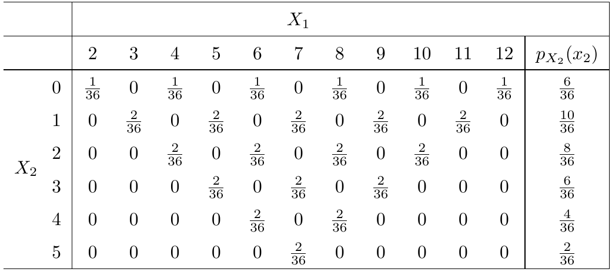

\newcommand\given[1][]{\:#1\vert\:}
\newcommand\P[1]{P{\left(#1\right)}}
\newcommand\F[1]{F_{\tiny{#1}}}
\newcommand\f[1]{f_{\tiny{#1}}}
\newcommand\p[1]{p_{\tiny{#1}}}

# DOFORV - distributions of functions of (continuous) random variables - continued

## DOFORV method 2 - direct "theorem"

I am delighted that the book downplays this method as not as easy to use. Nor do I recommend it for practical use.

**The cdf approach is usually the cleanest and least error prone.**

Theorem: Given $X$ with density $\f{X}(x)$ and $g$ monotone and differentiable with inverse $g^{-1}$ where $\f{X}(x) > 0$, let $Y=g(X)$. Then:
$$\f{Y}(y) = \f{X}(g^{-1}(y))\left|\frac{d}{dy}g^{-1}(y)\right|$$
This theorem can be extended to non-monotonic $g$. 

## DOFORV - three proofs

The theorem can be proved using the cdf approach and two other ways that are straight outta calculus.

The proofs indeed all look very similar. 

Proof 2: uses the "change of variables" method from integration (emphasizes my advice to always think of a density as living in an integral.)

Proof 3: uses the fundamental theorem of calculus.

## a seemingly strange example { .build }

The techniques apply to any continuous r.v. $X$ and to any differentiable, invertible $g(x)$.

So let's consider $X \sim \text{Exp}(\lambda)$ and let $g(x) = 1 - e^{-\lambda x}$. It turns out $Y \sim \text{Unif}[0,1]$.

The function $g$ was not chosen by accident---it it precisely the cdf $\F{X}(x)$ of $X$. 

Theorem: If $X$ is continuous and has cdf $\F{X}(x)$ then $Y = \F{X}(X)$ will have a uniform distribution on $[0,1]$.

Proof: ...

## another DOFORV example

Suppose $X\sim\text{Gamma}(\alpha, \lambda)$ and

$$g(x) = \begin{cases}\frac{1}{x} &: x > 0,\\
0 &: \text{otherwise.}\end{cases}$$ 

Determine the distribution of $Y = g(X)$ by finding its density.

# probabilities involving more than one random variable at a time

## motivation

A random variable is a function of a sample space, and we care about its distribution.

So far we've focussed on $X:S \to \mathbb{R}$.

Now we will look at $X:S \to \mathbb{R}^n$, which arise quite naturally. We've actually been doing this already sometimes, without saying so explicitly (see Case 2).

Case 1: you *actually observe* multiple things about a particular random outcome (e.g. you measure the weight and blood pressure of a randomly selected study participant.)

Case 2: you are considering a sequence of random variables that "replicate" the same "experiment" (e.g. repeat a Bernoulli($p$) trial $n$ times...) 

## discrete motivating example { .build }

Toss two fair six-sided dice. The sample space has 36 elements. 

Observe the total and the difference.

Denote the total by $X_1$ and the difference by $X_2$, and $X = (X_1, X_2)$

$X:S \to \mathbb{R}^2$ is a random variable and we can consider probabilities of the form $P(X \in A_1 \times A_2) = P(X_1 \in A_1, X_2 \in A_2)$ for $A_i \subset \mathbb{R}$. All such probabilities together form the "distribution" of $X$. 

But this is an excess of formality. Normally we work directly with the components, in this case $X_1$ and $X_2$, which are two discrete rvs and we can put probabilities of combinations of outcomes in a table.

## table of probabilities

## "joint" distribution

\<*Insert cannabis joke here*\>

Such a table summarizes the distribution of $X$, which we'll just call the *joint distribution* of $X_1$ and $X_2$.

The table has all the values of the form $p(x_1, x_2) = P(X_1=x_1, X_2=x_2)$ and is called the *joint* probability mass function.

A joint pmf is non-negative, and its positive values sum to 1 (just like before).

The joint cdf is defined as: $P(X_1 \le x_1, X_2 \le x_2)$ for all $(x_1, x_2) \in \mathbb{R^2}$. 

It is non-decreasing and right-continuous in both variables, and goes to 0 and 1 as both dimensions go to $\pm\infty$ respectively. 

## marginal distributions

The pmf of any of the component random variables can be recovered by summing over all the others, e.g.:
$$\p{X_1}(x_1) = \sum_{x_2}p(x_1, x_2),$$
(where $\sum_{x_2}$ denotes summing over all values that $X_2$ takes on.)

This is called a *marginal* pmf, which characterizes the distribution of that random variable. 

## example: marginal for $X_2$

